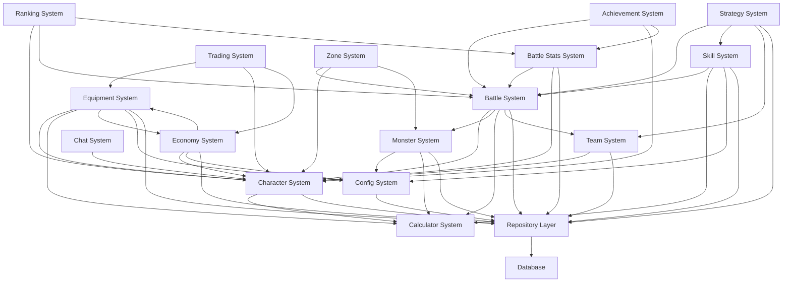

# Text WoW 系统架构文档

> 📌 **核心设计理念**: 清晰的系统分层、模块化设计、配置化平衡、易于扩展

---

## 📋 目录

1. [系统架构概览](#系统架构概览)
2. [系统分层架构](#系统分层架构)
3. [核心系统模块](#核心系统模块)
4. [系统依赖关系](#系统依赖关系)
5. [数据流设计](#数据流设计)
6. [配置化设计](#配置化设计)
7. [接口定义](#接口定义)
8. [未来扩展接口](#未来扩展接口)

---

## 系统架构概览

Text WoW 采用分层架构设计，将系统分为表现层、业务逻辑层、数据访问层和数据持久层。核心设计原则：

- **模块化**: 每个系统独立，通过接口交互
- **配置化**: 游戏平衡数据通过配置表管理，无需代码修改
- **可扩展**: 预留扩展接口，支持未来功能添加
- **易维护**: 清晰的依赖关系，降低系统复杂度

---

## 系统分层架构

```
┌─────────────────────────────────────────────────────────────┐
│                    表现层 (Presentation)                     │
│  ┌──────────────┐  ┌──────────────┐  ┌──────────────┐     │
│  │  前端UI组件   │  │  API Handlers │  │  WebSocket   │     │
│  │  Vue 3       │  │  Gin Router  │  │  (可选)      │     │
│  └──────────────┘  └──────────────┘  └──────────────┘     │
└─────────────────────────────────────────────────────────────┘
                            ↓ HTTP/WebSocket
┌─────────────────────────────────────────────────────────────┐
│                    业务逻辑层 (Domain)                        │
│  ┌──────────────┐  ┌──────────────┐  ┌──────────────┐     │
│  │  战斗系统     │  │  角色系统     │  │  装备系统⭐    │     │
│  │ BattleManager│  │ CharacterMgr  │  │ EquipmentMgr │     │
│  └──────────────┘  └──────────────┘  └──────────────┘     │
│  ┌──────────────┐  ┌──────────────┐  ┌──────────────┐     │
│  │  技能系统     │  │  策略系统     │  │  数值计算     │     │
│  │ SkillManager │  │ StrategyExec  │  │ Calculator   │     │
│  └──────────────┘  └──────────────┘  └──────────────┘     │
│  ┌──────────────┐  ┌──────────────┐  ┌──────────────┐     │
│  │  队伍系统     │  │  战斗统计     │  │  经济系统     │     │
│  │  TeamManager │  │ BattleStats  │  │ EconomyMgr   │     │
│  └──────────────┘  └──────────────┘  └──────────────┘     │
│  ┌──────────────┐  ┌──────────────┐  ┌──────────────┐     │
│  │  怪物系统     │  │  地图系统     │  │  配置管理     │     │
│  │ MonsterMgr    │  │  ZoneManager  │  │ ConfigMgr    │     │
│  └──────────────┘  └──────────────┘  └──────────────┘     │
└─────────────────────────────────────────────────────────────┘
                            ↓
┌─────────────────────────────────────────────────────────────┐
│                    数据访问层 (Repository)                    │
│  ┌──────────────┐  ┌──────────────┐  ┌──────────────┐     │
│  │ CharacterRepo│  │ EquipmentRepo│  │  BattleRepo   │     │
│  └──────────────┘  └──────────────┘  └──────────────┘     │
│  ┌──────────────┐  ┌──────────────┐  ┌──────────────┐     │
│  │ MonsterRepo  │  │  ConfigRepo  │  │  StatsRepo   │     │
│  └──────────────┘  └──────────────┘  └──────────────┘     │
└─────────────────────────────────────────────────────────────┘
                            ↓
┌─────────────────────────────────────────────────────────────┐
│                    数据持久层 (Database)                      │
│                    SQLite (WAL Mode)                         │
│  ┌──────────────┐  ┌──────────────┐  ┌──────────────┐     │
│  │  游戏数据表   │  │  配置数据表   │  │  统计数据表   │     │
│  │  (用户/角色)  │  │  (怪物/技能)  │  │  (战斗统计)   │     │
│  └──────────────┘  └──────────────┘  └──────────────┘     │
└─────────────────────────────────────────────────────────────┘
```

---

## 核心系统模块

### 基础系统（无依赖）

#### 1. 数值计算系统 (Calculator System)
- **职责**: 统一的数值计算逻辑
- **核心类**: `DamageCalculator`, `AttributeConverter`, `DefenseCalculator`
- **文件**: `server/internal/game/calculator.go`
- **特点**: 纯计算逻辑，无状态，无依赖

#### 2. 配置管理系统 (Config System)
- **职责**: 管理所有游戏配置数据（怪物、技能、装备等）
- **核心类**: `ConfigManager`, `ConfigLoader`
- **文件**: `server/internal/config/`
- **特点**: 
  - 配置数据存储在数据库配置表中
  - 支持热更新（无需重启）
  - 版本化管理，便于回滚
  - 减少数据迁移复杂度

### 核心系统（按优先级）

#### 3. 角色系统 (Character System) - 基础
- **职责**: 角色属性管理、属性点分配、等级成长
- **核心类**: `CharacterManager`, `AttributeCalculator`
- **依赖**: 数值计算系统
- **文件**: `server/internal/game/character_manager.go`

#### 4. 怪物系统 (Monster System) - 优先级0 ⭐
- **职责**: 怪物管理、怪物生成、怪物AI、平衡性配置
- **核心类**: `MonsterManager`, `MonsterGenerator`, `MonsterAI`
- **依赖**: 配置管理系统、数值计算系统
- **文件**: `server/internal/game/monster_manager.go` (待创建)
- **设计文档**: `docs/monster_system_design.md` (待创建)
- **特点**:
  - **丰富的怪物类型**: 不同怪物有不同的技能、属性、行为模式
  - **配置化平衡**: 怪物强度、掉落率等通过配置表管理
  - **避免一招走遍天下**: 不同怪物需要不同策略应对
  - **方便调整**: 修改配置表即可调整，无需代码修改
  - **怪物分类**:
    - 普通怪物 (Normal): 基础属性，简单AI
    - 精英怪物 (Elite): 增强属性，特殊技能
    - Boss怪物 (Boss): 高属性，复杂技能组合
    - 特殊怪物 (Special): 独特机制，特殊挑战

#### 5. 战斗系统 (Battle System) - 优先级1 ⭐
- **职责**: 战斗流程控制、回合管理、伤害计算、多角色战斗支持
- **核心类**: `BattleManager`, `BattleCalculator`, `TeamBattleManager`
- **依赖**: 角色系统、怪物系统、数值计算系统、队伍系统
- **文件**: `server/internal/game/battle_manager.go`
- **特点**: 支持单角色和多角色小队战斗

#### 6. 技能系统 (Skill System) - 优先级2 ⭐
- **职责**: 技能管理、冷却管理、效果应用
- **核心类**: `SkillManager`, `BuffManager`, `PassiveSkillManager`
- **依赖**: 战斗系统、数值计算系统、配置管理系统
- **文件**: `server/internal/game/skill_manager.go`

#### 7. 装备系统 (Equipment System) - 优先级3 ⭐⭐⭐ **核心系统**
- **职责**: 装备管理、词缀生成、属性加成计算、装备强化
- **核心类**: `EquipmentManager`, `AffixGenerator`, `EquipmentEnhancer`
- **依赖**: 角色系统、数值计算系统、经济系统、配置管理系统
- **文件**: `server/internal/game/equipment_manager.go`
- **设计理念**: 借鉴暗黑2
  - 随机词缀系统（前缀+后缀）
  - 装备品质分级（白/绿/蓝/紫/橙/传说）
  - 装备强化系统（材料强化）
  - 装备交易系统
  - 稀有装备掉落机制

#### 8. 策略系统 (Strategy System) - 优先级4
- **职责**: 策略解析、条件判断、技能选择、队伍策略
- **核心类**: `StrategyExecutor`, `ConditionEvaluator`, `TeamStrategyExecutor`
- **依赖**: 战斗系统、技能系统、队伍系统
- **文件**: `server/internal/game/strategy_executor.go`

#### 9. 队伍系统 (Team System) - 优先级5 ⭐
- **职责**: 队伍管理、角色搭配、队伍属性计算、队伍战斗
- **核心类**: `TeamManager`, `TeamComposition`, `TeamAttributeCalculator`
- **依赖**: 角色系统、战斗系统
- **文件**: `server/internal/game/team_manager.go` (待创建)
- **特点**: 初始1个角色，最多扩展到5人小队

#### 10. 战斗统计系统 (Battle Statistics System) - 优先级6 ⭐
- **职责**: 战斗数据收集、统计分析、数据展示、策略优化建议
- **核心类**: `BattleStatsCollector`, `StatsAnalyzer`, `StrategyOptimizer`
- **依赖**: 战斗系统、角色系统
- **文件**: `server/internal/game/battle_stats.go` (待创建)

#### 11. 经济系统 (Economy System) - 优先级7 ⭐
- **职责**: 金币管理、装备消耗、强化消耗、商店系统
- **核心类**: `EconomyManager`, `ShopManager`, `EnhancementCostCalculator`
- **依赖**: 装备系统、角色系统、配置管理系统
- **文件**: `server/internal/game/economy_manager.go` (待创建)

### 未来扩展系统（轻量级联网功能）

#### 12. 交易系统 (Trading System)
- **职责**: 玩家间交易、拍卖行、装备交易
- **依赖**: 装备系统、角色系统、经济系统

#### 13. 排名系统 (Ranking System)
- **职责**: 排行榜管理、排名计算、奖励发放
- **依赖**: 角色系统、战斗系统、战斗统计系统

#### 14. 公告/聊天系统 (Chat/Announcement System)
- **职责**: 聊天管理、公告发布、消息推送
- **依赖**: 用户系统

#### 15. 成就系统 (Achievement System)
- **职责**: 成就管理、进度追踪、奖励发放
- **依赖**: 战斗系统、角色系统、战斗统计系统

#### 16. 地图/副本系统 (Zone/Dungeon System)
- **职责**: 区域管理、副本生成、探索度
- **依赖**: 战斗系统、角色系统、怪物系统

---

## 系统依赖关系



---

## 数据流设计

### 战斗数据流

```
玩家请求战斗
    ↓
BattleManager 初始化战斗
    ↓
MonsterManager 生成怪物（从配置表读取）
    ↓
BattleManager 执行回合
    ↓
Calculator 计算伤害/治疗
    ↓
SkillManager 应用技能效果
    ↓
BattleStatsCollector 收集战斗数据
    ↓
战斗结束，更新角色数据
    ↓
EquipmentManager 处理装备掉落（从配置表读取掉落规则）
    ↓
EconomyManager 处理金币和经验奖励
```

### 配置数据流

```
配置表更新（数据库）
    ↓
ConfigManager 加载配置
    ↓
ConfigManager 缓存配置（内存）
    ↓
各系统通过 ConfigManager 获取配置
    ↓
配置变更时，ConfigManager 通知相关系统
    ↓
系统重新加载配置（热更新）
```

---

## 配置化设计

### 设计原则

1. **配置与代码分离**: 所有游戏平衡数据存储在配置表中
2. **版本化管理**: 配置变更记录版本，支持回滚
3. **热更新支持**: 配置变更无需重启服务
4. **减少数据迁移**: 通过配置表管理，避免频繁的数据库结构变更

### 配置表分类

#### 1. 怪物配置表 (monsters)
- 怪物基础属性（HP、攻击、防御等）
- 怪物技能配置
- 怪物AI行为模式
- 怪物掉落配置
- **平衡性调整**: 直接修改配置表即可调整怪物强度

#### 2. 技能配置表 (skills)
- 技能基础数值
- 技能冷却时间
- 技能消耗
- 技能效果
- **平衡性调整**: 修改技能数值即可调整技能强度

#### 3. 装备配置表 (items)
- 装备基础属性
- 词缀池配置
- 掉落率配置
- 强化消耗配置
- **平衡性调整**: 修改掉落率和词缀数值即可调整装备强度

#### 4. 经济配置表 (economy_config)
- 金币获取倍率
- 经验获取倍率
- 商店价格
- 强化消耗
- **平衡性调整**: 修改倍率和价格即可调整经济平衡

#### 5. 区域配置表 (zones)
- 区域等级范围
- 经验/金币倍率
- 怪物刷新配置
- **平衡性调整**: 修改倍率即可调整区域收益

### 配置管理接口

```go
// ConfigManager 配置管理器接口
type ConfigManager interface {
    // 加载配置
    LoadConfig(configType string) error
    
    // 获取配置
    GetMonsterConfig(monsterID string) (*MonsterConfig, error)
    GetSkillConfig(skillID string) (*SkillConfig, error)
    GetItemConfig(itemID string) (*ItemConfig, error)
    
    // 热更新配置
    ReloadConfig(configType string) error
    
    // 配置变更通知
    RegisterConfigChangeListener(listener ConfigChangeListener)
}
```

### 配置版本管理

```sql
-- 配置版本表
CREATE TABLE config_versions (
    id INTEGER PRIMARY KEY AUTOINCREMENT,
    config_type VARCHAR(32) NOT NULL,
    version INTEGER NOT NULL,
    config_data TEXT NOT NULL,  -- JSON格式的配置数据
    created_at DATETIME DEFAULT CURRENT_TIMESTAMP,
    created_by VARCHAR(32),
    description TEXT
);
```

---

## 接口定义

### 1. 数值计算接口

```go
// AttributeCalculator 属性计算接口
type AttributeCalculator interface {
    // 计算物理攻击力
    CalculatePhysicalAttack(char *Character) int
    
    // 计算法术攻击力
    CalculateMagicAttack(char *Character) int
    
    // 计算防御力
    CalculateDefense(char *Character) (physical, magic int)
    
    // 计算生命值
    CalculateHP(char *Character) int
    
    // 计算法力值
    CalculateMP(char *Character) int
}

// DamageCalculator 伤害计算接口
type DamageCalculator interface {
    // 计算伤害
    CalculateDamage(attacker, defender *Character, skill *Skill) int
    
    // 计算治疗
    CalculateHealing(healer, target *Character, skill *Skill) int
    
    // 计算暴击伤害
    CalculateCritDamage(baseDamage int, critDamage float64) int
    
    // 计算闪避
    ShouldDodge(attacker, defender *Character) bool
}
```

### 2. 战斗系统接口

```go
// BattleManager 战斗管理器接口
type BattleManager interface {
    // 开始战斗
    StartBattle(userID int, zoneID string) error
    
    // 执行回合
    ExecuteTurn(userID int) error
    
    // 获取战斗状态
    GetBattleStatus(userID int) (*BattleStatus, error)
    
    // 停止战斗
    StopBattle(userID int) error
}

// MonsterManager 怪物管理器接口
type MonsterManager interface {
    // 生成怪物
    GenerateMonster(zoneID string, level int) (*Monster, error)
    
    // 获取怪物配置
    GetMonsterConfig(monsterID string) (*MonsterConfig, error)
    
    // 更新怪物配置（热更新）
    UpdateMonsterConfig(monsterID string, config *MonsterConfig) error
}
```

### 3. 装备系统接口

```go
// EquipmentManager 装备管理器接口
type EquipmentManager interface {
    // 穿戴装备
    EquipItem(characterID int, itemID string) error
    
    // 卸下装备
    UnequipItem(characterID int, slot string) error
    
    // 生成装备词缀
    GenerateAffixes(itemID string, quality string) ([]Affix, error)
    
    // 强化装备
    EnhanceEquipment(characterID int, itemID string, materials []Material) error
}
```

### 4. 配置管理接口

```go
// ConfigManager 配置管理器接口
type ConfigManager interface {
    // 加载配置
    LoadConfig(configType string) error
    
    // 获取怪物配置
    GetMonsterConfig(monsterID string) (*MonsterConfig, error)
    
    // 获取技能配置
    GetSkillConfig(skillID string) (*SkillConfig, error)
    
    // 获取装备配置
    GetItemConfig(itemID string) (*ItemConfig, error)
    
    // 热更新配置
    ReloadConfig(configType string) error
}
```

---

## 未来扩展接口

### 1. 交易系统接口（预留）

```go
// TradingManager 交易管理器接口（预留）
type TradingManager interface {
    // 创建交易
    CreateTrade(sellerID, buyerID int, items []Item, price int) error
    
    // 完成交易
    CompleteTrade(tradeID int) error
    
    // 取消交易
    CancelTrade(tradeID int) error
}
```

### 2. 排名系统接口（预留）

```go
// RankingManager 排名管理器接口（预留）
type RankingManager interface {
    // 更新排名
    UpdateRanking(userID int, category string, score int) error
    
    // 获取排行榜
    GetLeaderboard(category string, limit int) ([]RankingEntry, error)
}
```

### 3. 成就系统接口（预留）

```go
// AchievementManager 成就管理器接口（预留）
type AchievementManager interface {
    // 检查成就进度
    CheckProgress(userID int, achievementID string) error
    
    // 完成成就
    CompleteAchievement(userID int, achievementID string) error
}
```

---

## 数据库设计原则

### 1. 配置表与数据表分离

- **配置表**: 存储游戏配置数据（怪物、技能、装备等），只读，通过配置管理更新
- **数据表**: 存储玩家数据（角色、装备实例、背包等），可读写

### 2. 版本化管理

- 配置变更记录版本
- 支持配置回滚
- 减少数据迁移复杂度

### 3. 扩展性设计

- 使用JSON字段存储灵活数据
- 预留扩展字段
- 避免频繁的表结构变更

---

## 总结

### 架构特点

1. **清晰的分层**: 表现层、业务逻辑层、数据访问层、数据持久层
2. **模块化设计**: 每个系统独立，通过接口交互
3. **配置化平衡**: 所有平衡数据通过配置表管理
4. **易于扩展**: 预留扩展接口，支持未来功能
5. **方便调整**: 配置热更新，无需重启服务

### 核心优势

- **减少数据迁移**: 通过配置表管理，避免频繁的数据库结构变更
- **快速平衡调整**: 修改配置表即可调整游戏平衡
- **丰富的怪物系统**: 不同怪物带来不同挑战，避免一招走遍天下
- **配置化设计**: 所有游戏平衡数据可配置，方便调整

---

**文档版本**: v1.0  
**最后更新**: 2025年


